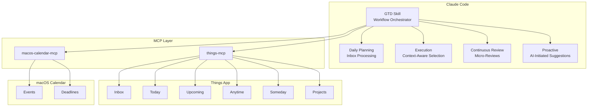
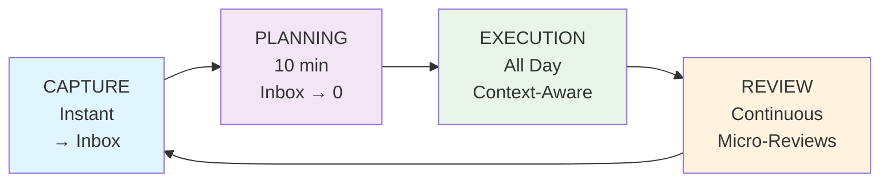
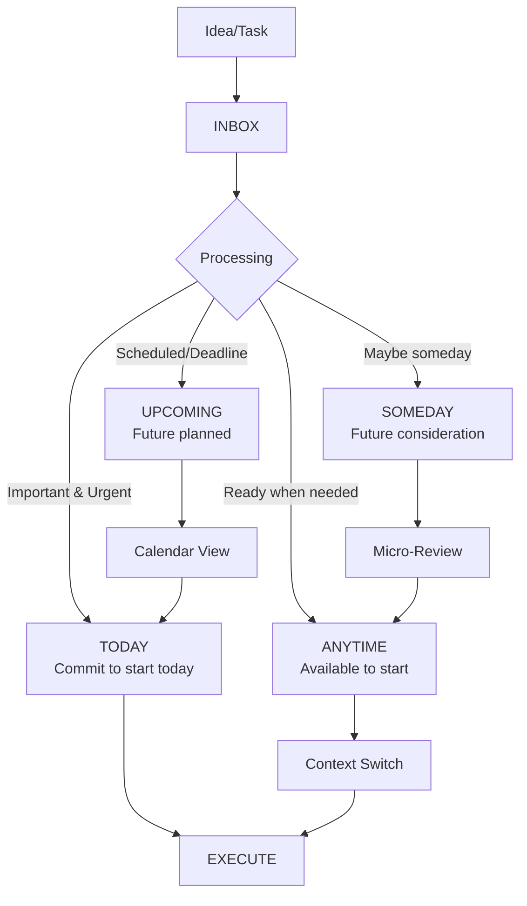

# My GTD Buddy

A Things-native Getting Things Done (GTD) workflow powered by Claude Code. This project implements a streamlined GTD system that leverages Things' built-in strengths with an intelligent AI skill to orchestrate workflow management.

## Table of Contents

- [Overview](#overview)
- [Key Features](#key-features)
- [Technology Stack](#technology-stack)
- [System Architecture](#system-architecture)
- [GTD Workflow](#gtd-workflow)
- [Project Structure](#project-structure)
- [Requirements](#requirements)
- [Important Warning](#important-warning)
- [Setup Guide](#setup-guide)
- [How to Use](#how-to-use)
- [Daily Workflow](#daily-workflow)
- [Customization](#customization)
- [Privacy Note](#privacy-note)

## Overview

This is my personal implementation of David Allen's GTD methodology, designed around the Things app with an intelligent Claude Code skill to orchestrate workflows. **While I use Things 3, you can adapt this system to work with any todo list app** by replacing the MCP server and updating the skill instructions.

The system focuses on:

- **Instant capture** — Everything goes to Things Inbox first
- **Daily planning** — Inbox to zero with interactive processing
- **Focused execution** — Context-aware task selection
- **Continuous review** — AI-driven micro-reviews, not heavy scheduled sessions
- **Proactive surfacing** — AI surfaces relevant info without being asked

> **See It In Action**: Check out [A Day with My GTD System.md](A%20Day%20with%20My%20GTD%20System.md) — a complete walkthrough from morning to night showing how the system handles real interruptions, context switching, and maintains focus.

## Key Features

- **Things-native scheduling** — Leverages Today/Upcoming/Anytime/Someday naturally
- **Calendar integration** — macOS Calendar for appointment + task coordination
- **Context tags** — Location (@home, @office) and energy (#high, #low, #quick) filtering
- **Proactive AI** — Surfaces deadlines, stale tasks, and suggestions automatically
- **Terse communication** — "Captured: [item]" not "I've successfully added..."
- **Continuous micro-reviews** — Surface issues as detected, not on schedule

## Technology Stack

- **[Claude Code](https://claude.ai/code)** — AI-powered CLI with Skills support
- **[things-mcp](https://github.com/cowboy/things-mcp)** — Direct integration with Things app
- **[macos-calendar-mcp](https://github.com/aiguofer/macos-calendar-mcp)** — macOS Calendar integration

## System Architecture



## GTD Workflow

### Workflow Phases



### Things List Flow



## Project Structure

```
.claude/
└── skills/
    └── gtd/
        ├── SKILL.md              # Main orchestrator (64 lines)
        ├── reference/
        │   ├── tools.md          # MCP tool reference
        │   ├── tags.md           # Tag system and setup
        │   └── fallbacks.md      # URL schemes for MCP failures
        └── workflows/
            ├── daily-planning.md # Interactive inbox processing
            ├── execution.md      # Context-aware task selection
            ├── review.md         # Continuous micro-reviews
            └── proactive.md      # AI-initiated suggestions

.mcp.json                         # MCP server configuration
A Day with My GTD System.md       # Real workflow example
```

## Requirements

- **Things 3** (macOS) — Or any todo list app with MCP integration
- **macOS Calendar** — For calendar integration
- **Claude Code** — AI-powered CLI
- **MCP servers** — things-mcp and macos-calendar-mcp

> **Using a Different Todo App?**
> Replace the Things MCP server with one for your preferred app (Todoist, Notion, etc.) and update the skill instructions to match your app's terminology.

## Important Warning

**AI systems can make mistakes!** This system has direct access to your Tasks and Calendar data. The AI may:

- Accidentally delete or modify tasks
- Move tasks to wrong lists or dates
- Create duplicate entries
- Mess up calendar events

**Recommendations:**

- **Test with non-critical data first**
- **Start slowly** — Begin with read-only commands
- **Backup regularly** — Export your Things data
- **Review AI actions** — Always verify, especially for important tasks

## Setup Guide

### 1. Install Prerequisites

```bash
# Install Claude Code
npm install -g @anthropic-ai/claude-code

# Install uv (Python package manager) if not already installed
curl -LsSf https://astral.sh/uv/install.sh | sh

# Install Node.js if not already installed (for calendar MCP)
# https://nodejs.org/
```

### 2. Clone This Repository

```bash
git clone https://github.com/realYushi/my-gtd-buddy.git
cd my-gtd-buddy
```

### 3. Set Up things-mcp

[things-mcp](https://github.com/cowboy/things-mcp) provides read/write access to Things 3.

```bash
# Clone into project directory
git clone https://github.com/cowboy/things-mcp.git

# Install dependencies
cd things-mcp
uv sync
cd ..
```

**Verify Things 3 is configured:**
1. Open Things 3
2. **Things → Settings → General** → Enable "Things URLs"
3. Keep Things running (MCP needs it open to access the database)

### 4. Set Up macos-calendar-mcp

[macos-calendar-mcp](https://github.com/aiguofer/macos-calendar-mcp) provides read/write access to macOS Calendar.

```bash
# Clone into project directory
git clone https://github.com/aiguofer/macos-calendar-mcp.git

# Install dependencies
cd macos-calendar-mcp
npm install
cd ..
```

**Grant calendar permissions:**
- When first run, macOS will prompt for Calendar access
- Allow access in System Settings → Privacy & Security → Calendars

### 5. Configure MCP

Create `.mcp.json` in the project root:

```json
{
  "mcpServers": {
    "things": {
      "command": "uv",
      "args": [
        "--directory",
        "/FULL/PATH/TO/my-gtd-buddy/things-mcp",
        "run",
        "things_server.py"
      ]
    },
    "calendar": {
      "command": "node",
      "args": [
        "/FULL/PATH/TO/my-gtd-buddy/macos-calendar-mcp/macos-calendar-mcp.js"
      ]
    }
  }
}
```

**Important:** Replace `/FULL/PATH/TO/` with your actual path (e.g., `/Users/yourname/projects/`).

### 6. Verify Setup

```bash
cd /path/to/my-gtd-buddy
claude

# Test Things connection
> what's in my inbox
# Should list your Things inbox items

# Test Calendar connection
> what's on my calendar today
# Should show today's events
```

**Troubleshooting:**
- If Things tools fail: Ensure Things 3 is open and URLs are enabled
- If Calendar tools fail: Check macOS privacy permissions
- Run `claude --mcp-debug` for detailed MCP connection logs

## How to Use

### Natural Language Commands

The GTD skill automatically routes based on intent:

```
# Planning (→ Daily Planning workflow)
process inbox
plan my day
what's in my inbox

# Execution (→ Execution workflow)
what should I do
I have 30 minutes
feeling tired, what can I work on

# Review (→ Review workflow)
weekly review
how did I do today
what did I accomplish

# Capture (→ Inbox, then continue)
remind me to call dentist
add task: prepare presentation
```

### Proactive AI Behavior

The skill surfaces information automatically:

- **Morning**: "3 things today — start with '[task]'?"
- **After completion**: "Nice. '[similar task]' next?"
- **Deadline approaching**: "'[task]' due tomorrow. Tackle now?"
- **Stale task**: "'[task]' sitting 7 days. Still relevant?"
- **End of day**: "2 items left. Tomorrow or quick finish?"

### Context-Aware Filtering

```
# By time
I have 15 minutes → suggests #quick tasks

# By energy
feeling tired → suggests #low energy tasks

# By location
I'm at home → filters for @home tasks
```

## Daily Workflow

### Morning (10 minutes)

1. **"process inbox"** — Interactive inbox processing
2. Answer: "Actionable?" → "Next action?" → "When?" → "Which area?"
3. Result: Inbox to zero, Today list ready

### Throughout Day

1. **"what should I do"** — Context-aware suggestions
2. **"I have X minutes"** — Time-based filtering
3. **Capture interruptions** — "remind me to..." → back to focus

### Continuous (AI-initiated)

- Deadline warnings (24-48h out)
- Stale task surfacing (7+ days)
- Stuck project detection (14+ days)
- End of day summary

### Weekly (5 minutes)

1. **"weekly review"** — Mind sweep
2. Brain dump → waiting check → someday glance
3. Forward look for upcoming week

## Customization

### For Different Todo Apps

1. Replace things-mcp with your app's MCP server
2. Update `reference/tools.md` with your app's tools
3. Modify workflow files for your app's terminology

### For Different Workflows

1. Edit files in `.claude/skills/gtd/workflows/`
2. Adjust trigger patterns in `SKILL.md`
3. Modify tag system in `reference/tags.md`

## Privacy Note

This is a **personal use project**. All sensitive data (API credentials, personal tasks) is excluded from version control.

---

_Built for personal productivity using GTD principles and Claude Code._
