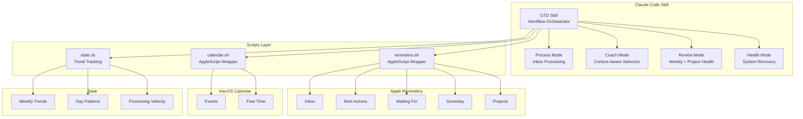
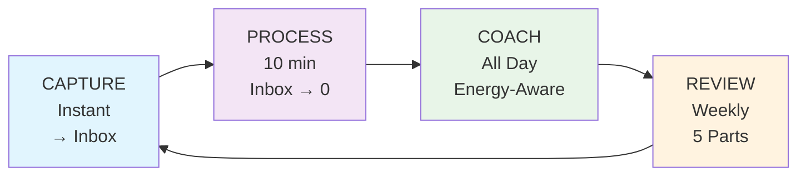
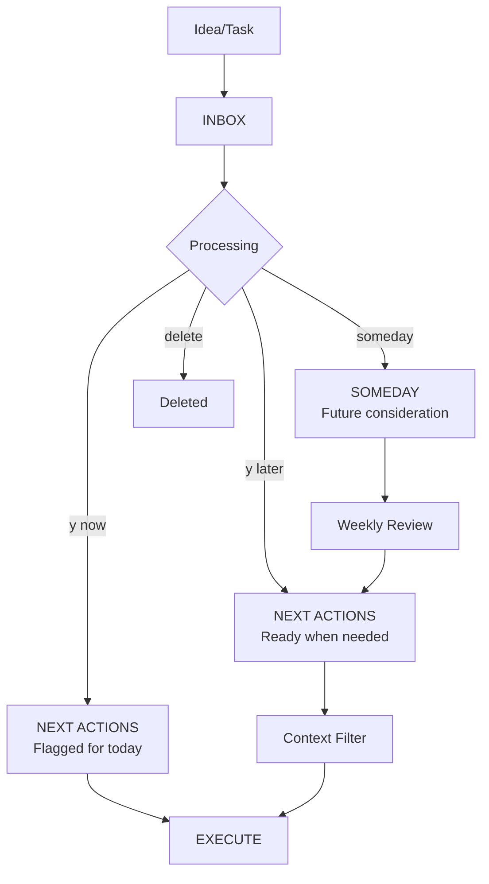

# My GTD Buddy

A Reminders-native Getting Things Done (GTD) workflow powered by Claude Code. This project implements a streamlined GTD system using Apple Reminders with an intelligent AI skill to orchestrate workflow management.

## Table of Contents

- [Overview](#overview)
- [Key Features](#key-features)
- [Technology Stack](#technology-stack)
- [System Architecture](#system-architecture)
- [GTD Workflow](#gtd-workflow)
- [Project Structure](#project-structure)
- [Requirements](#requirements)
- [Important Warning](#important-warning)
- [Setup Guide](#setup-guide)
- [How to Use](#how-to-use)
- [Daily Workflow](#daily-workflow)
- [Customization](#customization)
- [Privacy Note](#privacy-note)

## Overview

This is my personal implementation of David Allen's GTD methodology, designed around Apple Reminders with an intelligent Claude Code skill to orchestrate workflows. **While I use Apple Reminders, you can adapt this system to work with any todo list app** by modifying the shell scripts.

The system focuses on:

- **Instant capture** — Everything goes to Reminders Inbox first
- **Daily planning** — Inbox to zero with interactive processing
- **Focused execution** — Context-aware task selection with energy matching
- **Continuous review** — AI-driven micro-reviews with project health checks
- **Proactive surfacing** — AI surfaces relevant info using historical patterns
- **Undo support** — Safely undo moves and completions

> **See It In Action**: Check out [A Day with My GTD System.md](A%20Day%20with%20My%20GTD%20System.md) — a complete walkthrough from morning to night showing how the system handles real interruptions, context switching, and maintains focus. Also see [SCENARIOS.md](SCENARIOS.md) for recipes for common situations like "Post-Vacation Reset" or "5-Minute Gap".

## Key Features

- **Apple Reminders native** — Uses standard Reminders lists (Inbox, Next Actions, Waiting For, Someday, Projects)
- **Calendar integration** — macOS Calendar for appointment + task coordination
- **Context tags** — Location (@home, @office) and energy (#high, #low, #quick) in notes
- **Historical patterns** — Tracks velocity, peak days, context usage for smarter suggestions
- **Project health** — Detects orphan projects without next actions
- **Waiting nudges** — Shows waiting items with age, prompts for follow-ups
- **Undo support** — Undo last move/complete actions
- **Natural language dates** — "tomorrow 2pm", "next friday", "Jan 15"
- **Batch operations** — Declare bankruptcy on stale items
- **Terse communication** — "Captured: [item]" not "I've successfully added..."

## Technology Stack

- **[Claude Code](https://claude.ai/code)** — AI-powered CLI with Skills support
- **Apple Reminders** — Native macOS/iOS reminders app
- **macOS Calendar** — Native calendar app
- **yq** — YAML processor for robust state management
- **AppleScript** — Shell scripts wrapping osascript for Reminders/Calendar access

## System Architecture



## GTD Workflow

### Workflow Phases



### Reminders List Flow



## Project Structure

```
.claude/
└── skills/
    └── gtd/
        ├── SKILL.md              # Main orchestrator + routing
        ├── state.yaml            # Trends, patterns, preferences
        ├── modes/
        │   ├── process.md        # Interactive inbox processing
        │   ├── coach.md          # Context + energy-aware selection
        │   ├── review.md         # 5-part weekly review
        │   └── health.md         # System health + recovery
        ├── scripts/
        │   ├── reminders.sh      # Apple Reminders AppleScript wrapper
        │   ├── calendar.sh       # macOS Calendar AppleScript wrapper
        │   └── state.sh          # Trend and pattern tracking (uses yq)
        └── reference/
            └── tools.md          # Complete CLI reference

A Day with My GTD System.md       # Real workflow example
SCENARIOS.md                      # Common scenarios and recipes
```

## Requirements

- **macOS** — Required for AppleScript integration
- **Apple Reminders** — Pre-installed on macOS
- **macOS Calendar** — Pre-installed on macOS
- **Claude Code** — AI-powered CLI
- **yq** — Portable command-line YAML processor (`brew install yq`)

## Important Warning

**AI systems can make mistakes!** This system has direct access to your Reminders and Calendar data. The AI may:

- Accidentally delete or modify reminders
- Move items to wrong lists
- Create duplicate entries
- Mess up calendar events

**Recommendations:**

- **Test with non-critical data first**
- **Start slowly** — Begin with read-only commands
- **Use undo** — `./scripts/reminders.sh undo` reverses last move/complete
- **Review AI actions** — Always verify, especially for important tasks

## Setup Guide

### 1. Install Prerequisites

```bash
# Install Claude Code
npm install -g @anthropic-ai/claude-code

# Install yq
brew install yq
```

### 2. Clone This Repository

```bash
git clone https://github.com/realYushi/my-gtd-buddy.git
cd my-gtd-buddy
```

### 3. Set Up GTD Lists in Reminders

Open Apple Reminders and create these lists:
- **Inbox** — Capture bucket
- **Next Actions** — Actionable tasks
- **Waiting For** — Delegated/waiting items
- **Someday** — Maybe later
- **Projects** — Multi-step outcomes

Or run the setup script:
```bash
./scripts/reminders.sh setup
```

### 4. Make Scripts Executable

```bash
chmod +x .claude/skills/gtd/scripts/*.sh
```

### 5. Verify Setup

```bash
cd /path/to/my-gtd-buddy
claude

# Test Reminders connection
> /gtd
# Should show inbox count and health status

# Test specific commands
> process inbox
# Should start interactive inbox processing
```

**Troubleshooting:**
- If Reminders access fails: Grant Terminal/Claude access in System Settings → Privacy & Security → Automation
- If Calendar access fails: Grant access in System Settings → Privacy & Security → Calendars
- If `state.sh` fails: Ensure `yq` is installed (`brew install yq`)

## How to Use

### Natural Language Commands

The GTD skill automatically routes based on intent:

```
# Processing (→ Process mode)
process inbox
clear inbox
/gtd

# Coaching (→ Coach mode)
what should I do
I'm stuck
help me prioritize
feeling tired

# Review (→ Review mode)
weekly review
how am I doing
review

# Recovery (→ Health mode)
system is a mess
need to reset
cleanup
```

### Proactive AI Behavior

The skill surfaces information using your historical patterns:

- **Peak days**: "Tuesday is usually a strong day for you"
- **Velocity**: "You usually process 12 items per session"
- **Context**: "You do a lot @home — filter those?"
- **Trends**: "Completions down lately. Overwhelmed?"
- **Orphan projects**: "3 projects need a next action"
- **Stale waiting**: "'Email from John' waiting 10 days. Nudge?"

### Context-Aware Filtering

```
# By energy
feeling tired → suggests #low energy tasks
high energy → suggests deep work, creative tasks

# By location
I'm at home → filters for @home tasks

# By time available
I have 15 minutes → suggests #quick tasks
```

## Daily Workflow

### Morning (10 minutes)

1. **"process inbox"** — Interactive inbox processing
2. Answer: "Actionable? When?" → "y later" / "n delete" / "someday"
3. Result: Inbox to zero, Next Actions ready

### Throughout Day

1. **"what should I do"** — Energy + context-aware suggestions
2. **"I'm stuck on [task]"** — Get unstuck with breakdown
3. **Capture interruptions** — Added to inbox, process later

### Weekly Review (10 minutes)

5 parts:
1. **Wins** — Celebrate completed items
2. **Stuck** — Triage stale items (7+ days)
3. **Projects** — Ensure each has a next action
4. **Waiting** — Check waiting items, send nudges
5. **Mind sweep** — Capture anything floating in head

### Recovery (When Needed)

When system gets messy:
1. **Declare bankruptcy** — Batch defer all stale items
2. **Inbox blitz** — Rapid keep/dump
3. **Focus mode** — Pick just 3 for the week

## Customization

### For Different Todo Apps

1. Replace `reminders.sh` with scripts for your app
2. Update `reference/tools.md` with your commands
3. Modify mode files for your app's terminology

### For Different Workflows

1. Edit files in `.claude/skills/gtd/modes/`
2. Adjust routing patterns in `SKILL.md`
3. Modify tag system in `reference/tools.md`

### Tracking Preferences

Edit `state.yaml` to customize:
- `processing_style`: quick | thorough
- Health thresholds in `modes/health.md`

## Privacy Note

This is a **personal use project**. All data stays local on your Mac. The scripts use AppleScript to communicate with Reminders and Calendar — no cloud sync required.

---

_Built for personal productivity using GTD principles and Claude Code._
